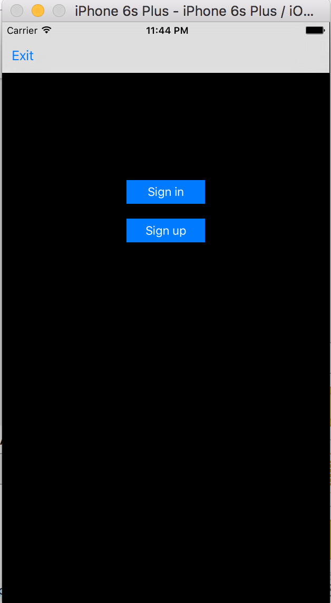
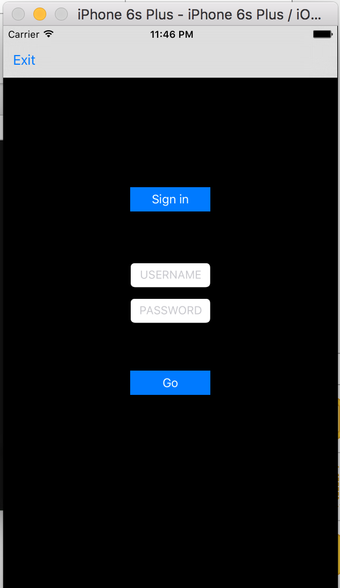
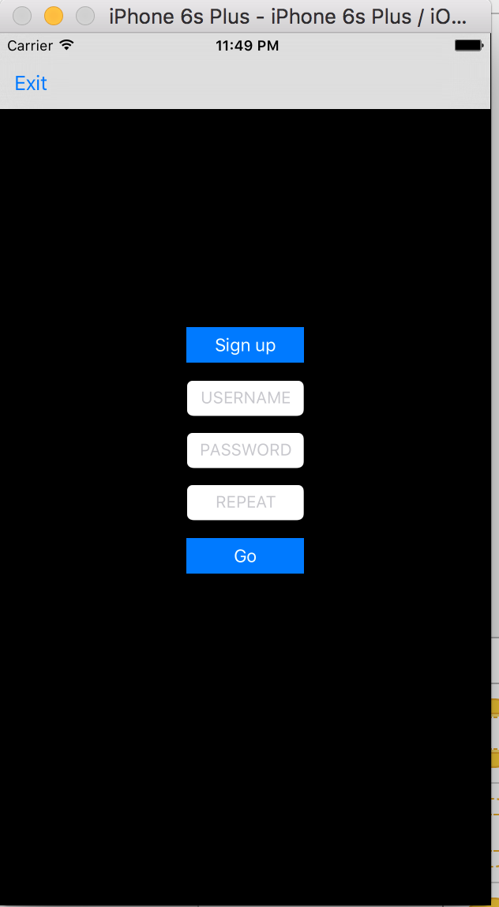

# Aplicación que llevará la contabilidad de los usuarios de Babilonia

 **Descripción de la app**
 
Tenemos la persistencia en el servidor de facebook con parse.
Tendremos dos tipos de usuarios --> normal y admin.

**Ususario normal**

Constará de un login, lista de elementos y una vista de la cantidad de productos que ha comprado desde la fecha inicio(primero de mes) hasta la fecha actual.

**Usuario admin**

Mismo que el usuario normal, pero además podrá añadir productos, cambiar precios y actualizar lo consumido por un usuario.

**Aparienca de la app**

*Pantalla inicial*

*Pulsamos el botón Sign in*

*Pulsamos el botón Sign up*

